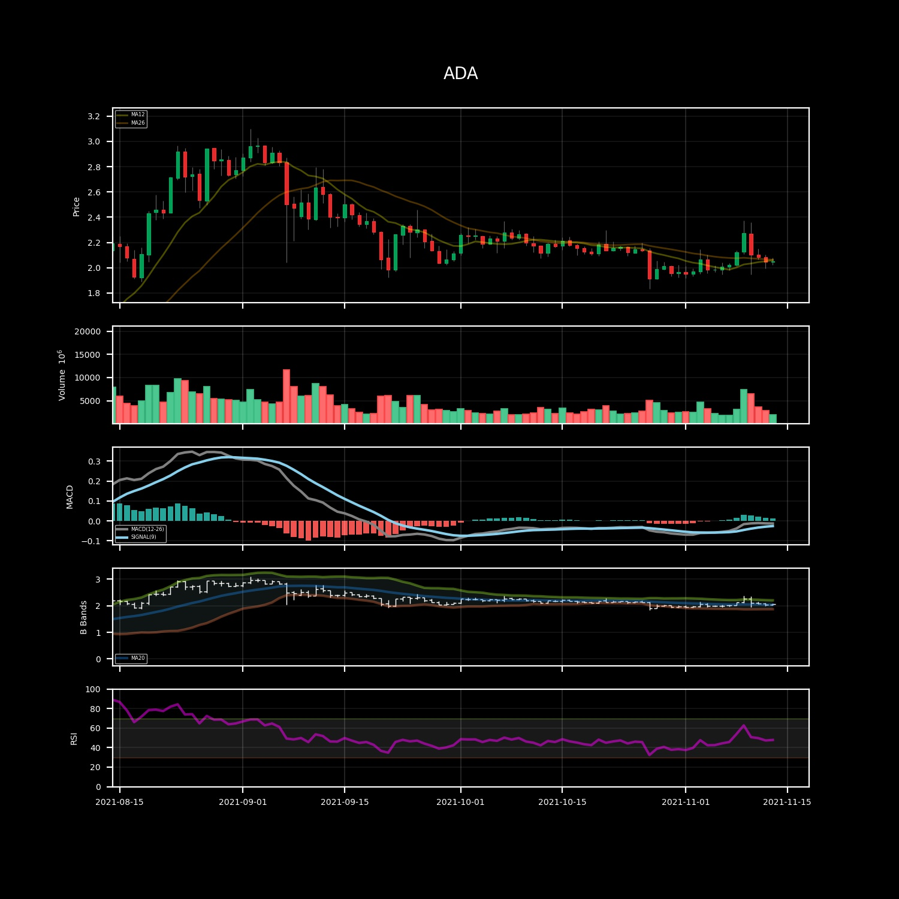
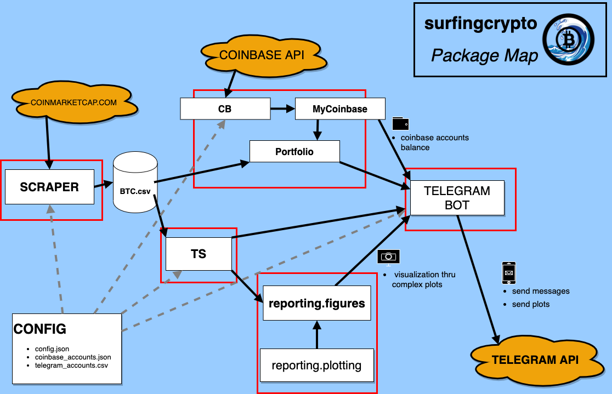

# Quick start

The `surfingcrypto` package is built to follow the crypto price data and *Coinbase* portfolio data.

In order to follow the daily close prices and portoflio gain/loss, the package features a `reporting` module that offers plotting capabilities. The `reporting.figures` submodule contains the definition of various kind graphs, from **candlesticks** daily prices with **technical analysis** indicators to **daily portfolio** gain/loss plots.



It is possible to get historical price data on any cryptocurrency listed on [coinmarketcap.com](http://www.coinmarketcap.com), such as `BTC`,`ETH`,`ADA`,`MATIC`, `SOL`.

The idea behind the package is to have a set of functions to produce daily reports, in form of plots and text. An example is as used as in [`main.py`](https://github.com/giocaizzi/surfingcrypto/blob/main/main.py).
This script is run on a AWS ec2 istance, every day at `10:30 AM UTC`. Paired with a notification system - I use Telegram - I get daily updates on my portfolio and coins that I want to monitor daily.

___
- [Quick start](#quick-start)
  - [Key modules](#key-modules)
  - [Basic usage](#basic-usage)
    - [Configuration](#configuration)
    - [Price data scraping](#price-data-scraping)
    - [Reporting](#reporting)
      - [Plotting prices and indicators](#plotting-prices-and-indicators)
      - [Reporting useful information](#reporting-useful-information)
  - [Package modules structure](#package-modules-structure)
___

## Key modules

1. The [Portoflio](../_autosummary/surfingcrypto.portfolio.portfolio.Portfolio.rst) object is the user Portfolio. Via the implemented APIs (at the moment, only **Coinbase**) get transaction history and tracks the portoflio live value, with gain/loss calculation.

2. The [Scraper](../_autosummary/surfingcrypto.scraper.Scraper.rst) object gets the necesarriy data from [coinmarketcap.com](http://www.coinmarketcap.com) and stores data locally. 

3. The [TS](../_autosummary/surfingcrypto.ts.TS.rst) object is implemented so to offer time-series calculation (TA Indicators, distance from ATH and other statistics) and easy access to the data as *pandas.DataFrame* objects or simple object attributes.

4. The [surfingcrypto.reporting.figures](../_autosummary/surfingcrypto.reporting.figures.rst) module contains the definition of a series of plots that help visualize crypto prices and portfolio stock gain/loss and balance.
  
The folder `examples` containsa a series of examples that allows to experiment interactively with the repository capacities.

## Basic usage

### Configuration

The [Config()](../_autosummary/surfingcrypto.config.Config.rst) class is used to pass the user configuration.

It requires to specify the location of the folder in which there is a `config.json` file, in which it is possible/required to specify the following parameters:
* a `coins` dictionary containg the parametrization of Technical Analysis (eg. window of moving averages, RSI length, etc...). 
* the API key to the [Coinbase](https://developers.coinbase.com/) client. 

### Price data scraping

The [Scraper](../_autosummary/surfingcrypto.scraper.Scraper.rst) gets the necesarriy data from [coinmarketcap.com](http://www.coinmarketcap.com) and stores data locally. 

The data date ranges, required by both the `portfolio` and `reporting` module, are passed to `Scraper` via the `Config` object.

[Go to full example.](../examples/scraper.ipynb)

### Reporting 

The reporting structure is based on the production of graphs and by well-structured text.

#### Plotting prices and indicators

There following are the kind of plots that have been implemented.

- `SimplePlot` Simple plot.
  - candlesticks
  - volume

- `TaPlot` Technical Analysis plot. 
  - candlestick (with MA lines)
  - volume
  - MACD 
  - Bollinger bands
  - RSI

- `ATHPlot` Distance from ATH plot

- `PortfolioPlot` All plots related to the user portfolio.
  
- `CalendarPlot` Calendar plot of a variable.

[Go to full example.](../examples/reporting.ipynb)


Most plots inherits from the same base object `BaseFigure` that has useful methods for working with matplotlib figures.

#### Reporting useful information

The `reporting.reporting` module is made of a set of methods, such as `report_percentage_diff`, that produce a well structured string with formatting to be easily read.

```
**ADA**
- 1d: 0.36 %
- 3d: -2.32 %
- 7d: 2.32 %
- 14d: 4.89 %
- 60d: -14.30 %
```
Ex: percentage difference for a set of different days.

## Package modules structure

The following image depicts the package module structure and integration architecture.

**TO BE UPDATED!**

